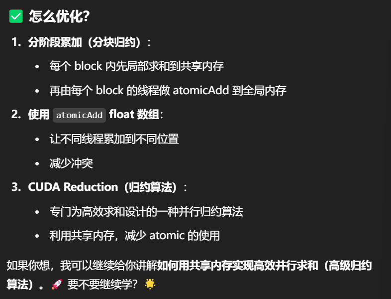

# CUDA 开发文档
***
## 下载与环境配置
> 操作流程（显卡不是N卡的可以划走了）  
> 1.先安装显卡驱动  
> 2.使用*nvidia-smi*命令查看显卡驱动的版本 
> 左上角为cuda最高支持版本  
> 3.安装cuda与cuDNN
> > CUDA  
> > 1.[[点我](https://developer.nvidia.com/cuda-toolkit-archive)]前往安装页面  
> >2.下载安装（记得提前下好Visual Studio把c++部分勾选，因为下载cuda时需要借助VS的）   
> >3.环境变量应该是自动添加的所以无需操心  
> >4.判断是否安装：win+R键运行cmd，输入nvcc --version 即可查看版本号   
> 
> cuDNN
> > 1.[[点我](https://developer.nvidia.com/cudnn-downloads)]前往安装页面  
> > 2.需要先行注册，之后依据自己cuda的版本进行安装  
> >3.下载后发现其实cudnn不是一个exe文件，而是一个压缩包，解压后，有三个文件夹，把三个文件夹拷贝到cuda的安装目录下。
> >配置这四个系统变量到Path（具体根据自己的安装路径配置）
> > >C:\Program Files\NVIDIA GPU Computing Toolkit\CUDA\v10.1\bin  
> > >C:\Program Files\NVIDIA GPU Computing Toolkit\CUDA\v10.1\include  
> > >C:\Program Files\NVIDIA GPU Computing Toolkit\CUDA\v10.1\lib  
> > >C:\Program Files\NVIDIA GPU Computing Toolkit\CUDA\v10.1\libnvvp  
> >
> >4.首先win+R启动cmd，cd到安装目录下的 …\extras\demo_suite,然后分别执行bandwidthTest.exe和deviceQuery.exe（进到目录后需要直接输“bandwidthTest.exe”和“deviceQuery.exe”）

## VSCODE设置

## 必要操作
### 编译与启动 '.cu' 文件
```
/*先cd到cu文件所处的文件夹
  编译语句nvcc 名字.cu -o 名字
  运行语句.\名字.exe
*/
```
GPT询问样例'（Bank Conflicts in Shared Memory请向我讲解这部分知识并给我提供一个具有详细注释的关于Test an access pattern that causes bank conflicts; measure performance impact.的完整代码以及关于Overlooking bank conflict in shared memory accesses.的错误解析）'
***
|概念 | 类比/解释|
|---|---|
|SM（Streaming Multiprocessor） | 一个“多线程计算工厂”|
|Thread Block | 一批“工人”|
|Warp | 32 个工人组成的执行小组（一起干活）|
|SIMT | 所有工人做的是同一件事，但每个人有自己的工作台（寄存器、地址）|
|GPU 执行模型 | 调度器把线程块安排给工厂，有空就安排新的任务|
|与 CPU 区别 | 没有分支预测，没有推测执行，执行顺序严格一致，但能处理海量线程并行|
***
## Day1 运行第一个cuda程序
```
#include <stdio.h>

// 设备端的 kernel 函数
__global__ void helloFromGPU() {
    // 只从一个线程打印

        printf("Hello from GPU thread!\n");

}

int main() {
    // 在 GPU 上启动 3 个 block，2 个线程
    helloFromGPU<<<3, 2>>>();

    // 等待 GPU 执行完成
    cudaDeviceSynchronize();

    return 0;
}

```
 `_global_ ` 表示这是一个运行在 GPU 上、由 CPU 调用的函数（即 kernel 函数）  
 `<<<1, 1>>>` 表示启动 1 个 block，每个 block 1 个线程。  

`threadIdx.x == 0 && blockIdx.x == 0` 是为了确保只由一个线程打印，避免多个线程重复输出。  

`cudaDeviceSynchronize()` 用来等待 GPU 上的 kernel 执行结束，确保主程序不会提前退出。

## Day2 
```
#include <iostream>
using namespace std;

// GPU 内核函数
__global__ void VecAdd(float* A, float* B, float* C, int N)
{
    int i = threadIdx.x;
    if (i < N) {
        C[i] = A[i] + B[i];
        printf("GPU thread %d: C[%d] = %f\n", i, i, C[i]);
    }
}
/*你在 kernel 中使用了 A[i], B[i], C[i]，但它们是 CPU 主机端的数组（float A[10]）。

而 CUDA 中的规则是：

GPU 代码（__global__ 函数）只能访问设备（GPU）内存，不能直接访问主机内存。

你需要：

把 A、B、C 分配到 GPU（设备）上

把主机数据拷贝到设备

执行 kernel

把计算结果从设备拷贝回主机

*/
int main()
{
    int N = 10;
    size_t size = N * sizeof(float);//主机端的10位的内存大小

    // 主机端数组
    float h_A[10] = {1.2 ,2 ,34 ,4.6 ,45 ,75.5 ,456 ,43.3,99,100.1};
    float h_B[10] = {1.2 ,2 ,34 ,4.6 ,45 ,75.5 ,456 ,43.3,99,100.1};
    float h_C[10];

    // 设备端指针
    float *d_A, *d_B, *d_C;

    // 1. 在设备上分配内存
    cudaMalloc((void**)&d_A, size);
    cudaMalloc((void**)&d_B, size);
    cudaMalloc((void**)&d_C, size);

    // 2. 将主机数据拷贝到设备
    cudaMemcpy(d_A, h_A, size, cudaMemcpyHostToDevice);
    cudaMemcpy(d_B, h_B, size, cudaMemcpyHostToDevice);

    // 3. 启动 kernel，1 个 block，N 个线程
    VecAdd<<<1, N>>>(d_A, d_B, d_C, N);

    // 4. 等待 GPU 执行完成
    cudaDeviceSynchronize();

    // 5. 将结果从设备复制回主机
    cudaMemcpy(h_C, d_C, size, cudaMemcpyDeviceToHost);

    // 6. 主机端输出结果
    cout << "\n主机输出加法结果:\n";
    for (int i = 0; i < N; ++i)
        cout << "C[" << i << "] = " << h_C[i] << endl;

    // 7. 释放设备内存
    cudaFree(d_A);
    cudaFree(d_B);
    cudaFree(d_C);

    return 0;
}
```
`cudaMalloc((void**)&d_A, size)`在 GPU 上申请内存  

`cudaMemcpy(d_A, h_A, size, cudaMemcpyHostToDevice)`主机与设备之间传数据`cudaMemcpyDeviceToHost`  

`threadIdx.x`获取当前线程在 block 中的编号

## Day3 矩阵加法
```
#include <iostream>
using namespace std;

// 定义矩阵大小 N × N
#define N 4  // 可以改成其他数值，如 16、32、1024

// GPU 上运行的 kernel 函数，负责执行矩阵加法
__global__ void MatAdd(float A[N][N], float B[N][N], float C[N][N])
{
    int i = threadIdx.x;  // 当前线程在 block 中的 x 坐标（对应行）
    int j = threadIdx.y;  // 当前线程在 block 中的 y 坐标（对应列）

    // 每个线程负责计算一个元素
    C[i][j] = A[i][j] + B[i][j];
    printf("GPU thread (%d,%d): C[%d][%d] = %f\n", i, j, i, j, C[i][j]);
}

int main()
{
    // 主机端定义三个矩阵（h_A, h_B, h_C），N × N 大小
    float h_A[N][N], h_B[N][N], h_C[N][N];

    // 初始化输入矩阵 A 和 B（主机端）
    for (int i = 0; i < N; ++i)
    {
        for (int j = 0; j < N; ++j)
        {
            h_A[i][j] = i + j;           // 举例：对角线为 0,2,4,...
            h_B[i][j] = i * j + 1;       // 举例：含乘法变化
        }
    }

    // 定义设备端指针
    float (*d_A)[N], (*d_B)[N], (*d_C)[N];

    size_t bytes = N * N * sizeof(float);

    // 在设备端申请内存（注意是二维数组，需要特殊处理）
    cudaMalloc((void**)&d_A, bytes);
    cudaMalloc((void**)&d_B, bytes);
    cudaMalloc((void**)&d_C, bytes);

    // 将主机端数据拷贝到设备端
    cudaMemcpy(d_A, h_A, bytes, cudaMemcpyHostToDevice);
    cudaMemcpy(d_B, h_B, bytes, cudaMemcpyHostToDevice);

    // 设置线程组织方式：一个 block，block 中 N × N 个线程
    dim3 threadsPerBlock(N, N); // 每个 block 是 N × N 的二维线程网格
    int numBlocks = 1;

    // 启动 kernel 函数：执行矩阵加法
    MatAdd<<<numBlocks, threadsPerBlock>>>(d_A, d_B, d_C);

    // 等待 GPU 执行完毕
    cudaDeviceSynchronize();

    // 将结果从设备复制回主机
    cudaMemcpy(h_C, d_C, bytes, cudaMemcpyDeviceToHost);

    // 在主机端输出加法结果矩阵
    cout << "\n主机输出矩阵加法结果 C = A + B ：" << endl;
    for (int i = 0; i < N; ++i)
    {
        for (int j = 0; j < N; ++j)
        {
            cout << h_C[i][j] << "\t";
        }
        cout << endl;
    }

    // 释放设备端内存
    cudaFree(d_A);
    cudaFree(d_B);
    cudaFree(d_C);

    return 0;
}
```
`dim3 threadsPerBlock(N, N)` 定义每个 block 中有 N × N 个线程  
dim3 是 CUDA 提供的一个用于表示 一维、二维或三维维度信息的结构体，它可以用来定义：

一个线程块（block）中线程的布局（threads per block）

网格中线程块的布局（blocks per grid）  
```
dim3 tjkkhreadsPerBlock(4, 3); // 表示一个 block 内部是 4 行 3 列的线程，总共 4×3=12 个线程
```

###可视化线程分配
```
#include <stdio.h>

#define N 8               // 矩阵尺寸 N x N
#define BLOCK_SIZE 4      // 每个 block 是 BLOCK_SIZE x BLOCK_SIZE 的线程网格

// CUDA 核函数：演示每个线程的位置及其处理的矩阵坐标
__global__ void ShowThreadMap()
{
    // 计算全局坐标（线程处理的矩阵位置）
    int i = blockIdx.x * blockDim.x + threadIdx.x; // 列
    int j = blockIdx.y * blockDim.y + threadIdx.y; // 行

    // 每个线程打印自己的 block/thread 和处理的位置
    if (i < N && j < N)
    {
        printf("Block(%d,%d), Thread(%d,%d) => Element[%d][%d]\n",
               blockIdx.x, blockIdx.y,
               threadIdx.x, threadIdx.y,
               j, i);
    }
}

int main()
{
    // 设置线程块和网格维度
    dim3 threadsPerBlock(BLOCK_SIZE, BLOCK_SIZE);
    dim3 numBlocks((N + BLOCK_SIZE - 1) / BLOCK_SIZE, (N + BLOCK_SIZE - 1) / BLOCK_SIZE);

    // 启动 kernel
    ShowThreadMap<<<numBlocks, threadsPerBlock>>>();
    cudaDeviceSynchronize();

    return 0;
}
```
##Day4 Inspect warp size波前大小
***
|概念|解释|
|---|---|
|warp|32个线程组成的最小执行单元|
|warpSize|固定为 32（可通过常量访问)|
|线程分组|block 中的线程按 32 个为一组划分为多个 warp|
|SIMT 执行模型|warp 内所有线程执行同一条指令|
|分支开销|warp内线程有分支会导致性能下降|

##Day5 小数组逐元素加法
```
#include <iostream>
#include <cuda_runtime.h>
using namespace std;

// CUDA 核函数（kernel）：进行逐元素加法
__global__ void VecAdd(float* A, float* B, float* C, int N)
{
    // 每个线程处理数组中的一个元素
    int i = threadIdx.x;

    if (i < N) {  // 防止线程数多于数组长度时越界
        C[i] = A[i] + B[i];
    }
}

int main()
{
    const int N = 5;
    size_t size = N * sizeof(float);  // 每个数组大小（字节数）

    // ======================== //
    // 1. 在 CPU 上声明并初始化数据
    // ======================== //
    float h_A[N] = {1.0, 2.0, 3.0, 4.0, 5.0};
    float h_B[N] = {10.0, 20.0, 30.0, 40.0, 50.0};
    float h_C[N];  // 用于接收结果

    // ======================== //
    // 2. 在 GPU 上分配内存
    // ======================== //
    float *d_A, *d_B, *d_C;
    cudaMalloc((void**)&d_A, size);  // 分配 A 数组的显存
    cudaMalloc((void**)&d_B, size);  // 分配 B 数组的显存
    cudaMalloc((void**)&d_C, size);  // 分配 C 数组的显存（输出）

    // ======================== //
    // 3. 将数据从 CPU 拷贝到 GPU
    // ======================== //
    cudaMemcpy(d_A, h_A, size, cudaMemcpyHostToDevice);
    cudaMemcpy(d_B, h_B, size, cudaMemcpyHostToDevice);

    // ======================== //
    // 4. 启动 CUDA 内核执行加法
    // ======================== //
    VecAdd<<<1, N>>>(d_A, d_B, d_C, N);  // 启动 1 个 block，N 个线程
    cudaDeviceSynchronize();  // 等待 GPU 执行完成

    // ======================== //
    // 5. 把结果从 GPU 拷贝回 CPU
    // ======================== //
    cudaMemcpy(h_C, d_C, size, cudaMemcpyDeviceToHost);

    // ======================== //
    // 6. 打印输出结果
    // ======================== //
    cout << "结果 C = A + B : ";
    for (int i = 0; i < N; ++i) {
        cout << h_C[i] << " ";
    }
    cout << endl;

    // ======================== //
    // 7. 释放显存
    // ======================== //
    cudaFree(d_A);
    cudaFree(d_B);
    cudaFree(d_C);

    return 0;
}
```
`cudaFree()`释放 GPU 上的显存资源
***
将数据从主机（CPU）复制到全局存储器（GPU），执行简单计算（如平方运算），再将结果传回主机，并输出结果。  
```
#include <iostream>
#include <cuda_runtime.h>
using namespace std;

// CUDA 核函数：将每个元素平方
__global__ void SquareKernel(float* d_in, float* d_out, int N) {
    int i = threadIdx.x + blockIdx.x * blockDim.x;  // 计算全局线程索引
    if (i < N) {
        d_out[i] = d_in[i] * d_in[i];  // 简单的计算：平方
    }
}

int main() {
    const int N = 10;
    size_t size = N * sizeof(float);  // 总内存大小 = 元素数量 × float大小

    // -------------------------
    // 1. 主机端数据初始化
    // -------------------------
    float h_in[N], h_out[N];
    for (int i = 0; i < N; ++i) {
        h_in[i] = static_cast<float>(i + 1);  // 初始化为 1 到 10
    }

    // -------------------------
    // 2. 设备端内存分配
    // -------------------------
    float *d_in, *d_out;
    cudaMalloc((void**)&d_in, size);  // 分配输入数组显存
    cudaMalloc((void**)&d_out, size); // 分配输出数组显存

    // -------------------------
    // 3. 从主机拷贝数据到设备
    // -------------------------
    cudaMemcpy(d_in, h_in, size, cudaMemcpyHostToDevice);

    // -------------------------
    // 4. 启动内核函数
    // -------------------------
    int threadsPerBlock = 256;
    int numBlocks = (N + threadsPerBlock - 1) / threadsPerBlock;
    SquareKernel<<<numBlocks, threadsPerBlock>>>(d_in, d_out, N);

    // 同步等待 GPU 完成
    cudaDeviceSynchronize();

    // -------------------------
    // 5. 将结果从设备拷贝回主机
    // -------------------------
    cudaMemcpy(h_out, d_out, size, cudaMemcpyDeviceToHost);

    // -------------------------
    // 6. 打印输出结果
    // -------------------------
    cout << "输入值\t平方结果" << endl;
    for (int i = 0; i < N; ++i) {
        cout << h_in[i] << "\t" << h_out[i] << endl;
    }

    // -------------------------
    // 7. 释放 GPU 显存
    // -------------------------
    cudaFree(d_in);
    cudaFree(d_out);

    return 0;
}
```
`SquareKernel` CUDA 核函数，每个线程平方一个元素

## Memory Alignment（内存对齐）&Memory Coalescing（内存合并访问）
内存对齐是指：GPU（或 CPU）访问内存时，如果访问地址是 按某种规则排列（比如按 32 字节对齐），访问效率会更高 
```
#include <cuda_runtime.h>
#include <stdio.h>
#include <chrono>

const int N = 1 << 20; // 1M elements

// ✅ 合并内存访问
__global__ void coalesced_access(float *input, float *output) {
    int i = blockIdx.x * blockDim.x + threadIdx.x;
    if (i < N)
        output[i] = input[i] * 2.0f; // 连续访问 input[i]
}

// ❌ 非合并内存访问
__global__ void non_coalesced_access(float *input, float *output) {
    int i = blockIdx.x * blockDim.x + threadIdx.x;
    if (i < N)
        output[i] = input[i * 32] * 2.0f; // 线程访问不连续，间隔跳跃
}

void benchmark_kernel(void (*kernel)(float*, float*), const char* name) {
    float *d_in, *d_out;
    float *h_in = new float[N];
    float *h_out = new float[N];

    for (int i = 0; i < N; i++)
        h_in[i] = static_cast<float>(i);

    cudaMalloc(&d_in, N * sizeof(float));
    cudaMalloc(&d_out, N * sizeof(float));

    cudaMemcpy(d_in, h_in, N * sizeof(float), cudaMemcpyHostToDevice);

    int threadsPerBlock = 256;
    int numBlocks = (N + threadsPerBlock - 1) / threadsPerBlock;

    // 计时开始
    auto start = std::chrono::high_resolution_clock::now();

    // 启动内核
    kernel<<<numBlocks, threadsPerBlock>>>(d_in, d_out);
    cudaDeviceSynchronize();

    // 计时结束
    auto end = std::chrono::high_resolution_clock::now();
    std::chrono::duration<double, std::milli> elapsed = end - start;

    printf("%s: %.3f ms\n", name, elapsed.count());

    cudaMemcpy(h_out, d_out, N * sizeof(float), cudaMemcpyDeviceToHost);

    // 可选：验证输出正确性
    // for (int i = 0; i < 10; i++) printf("%.1f ", h_out[i]);

    cudaFree(d_in);
    cudaFree(d_out);
    delete[] h_in;
    delete[] h_out;
}

int main() {
    benchmark_kernel(coalesced_access, "✅ Coalesced Access");
    benchmark_kernel(non_coalesced_access, "❌ Non-Coalesced Access");
    return 0;
}
```

`cuda_runtime.h`：CUDA 的基本函数（比如 cudaMalloc、cudaMemcpy 等）

## Shared Memory Fundamentals（共享内存基础）
在 CUDA 中，共享内存（Shared Memory）是每个 线程块（Thread Block）内部共享的快速内存区域，位于 GPU 的片上（on-chip），访问速度远快于全局内存（Global Memory）。

### Tile-based Matrix Multiplication（基于共享内存的矩阵乘法）
假设我们计算两个矩阵 A 和 B 的乘积 C = A × B。
我们可以把矩阵切成 tile（瓦片），每个 thread block 计算输出矩阵中的一个 tile，利用共享内存重复利用 A、B 中的子块，从而提升内存访问效率
```
#include <cuda_runtime.h>
#include <iostream>

#define N 1024           // 假设矩阵大小为 N × N
#define TILE_SIZE 32     // tile 大小：每个 block 处理 TILE_SIZE × TILE_SIZE 个元素

// CUDA 矩阵乘法内核，使用共享内存加速
__global__ void MatMulShared(float *A, float *B, float *C, int n) {
    // 每个线程的全局行列索引
    int row = blockIdx.y * TILE_SIZE + threadIdx.y;
    int col = blockIdx.x * TILE_SIZE + threadIdx.x;

    // 声明 tile 缓存，放在 shared memory 中
    __shared__ float tile_A[TILE_SIZE][TILE_SIZE];
    __shared__ float tile_B[TILE_SIZE][TILE_SIZE];

    float sum = 0.0f;

    // 遍历 tile 步长
    for (int m = 0; m < n / TILE_SIZE; ++m) {
        // 将 A 和 B 中的 tile 装入 shared memory
        tile_A[threadIdx.y][threadIdx.x] = A[row * n + m * TILE_SIZE + threadIdx.x];
        tile_B[threadIdx.y][threadIdx.x] = B[(m * TILE_SIZE + threadIdx.y) * n + col];

        __syncthreads(); // 所有线程加载完后再执行计算

        // 计算当前 tile 中一行一列的点积
        for (int k = 0; k < TILE_SIZE; ++k)
            sum += tile_A[threadIdx.y][k] * tile_B[k][threadIdx.x];

        __syncthreads(); // 确保当前 tile 计算完再加载下一个 tile
    }

    // 写入结果矩阵 C
    C[row * n + col] = sum;
}

int main() {
    int size = N * N * sizeof(float);

    // 分配主机内存
    float *h_A = new float[N * N];
    float *h_B = new float[N * N];
    float *h_C = new float[N * N];

    // 初始化输入矩阵 A 和 B
    for (int i = 0; i < N * N; ++i) {
        h_A[i] = 1.0f;  // 或者 rand() % 100
        h_B[i] = 2.0f;
    }

    // 分配设备内存
    float *d_A, *d_B, *d_C;
    cudaMalloc((void**)&d_A, size);
    cudaMalloc((void**)&d_B, size);
    cudaMalloc((void**)&d_C, size);

    // 拷贝数据到设备
    cudaMemcpy(d_A, h_A, size, cudaMemcpyHostToDevice);
    cudaMemcpy(d_B, h_B, size, cudaMemcpyHostToDevice);

    // 设置线程块和网格维度
    dim3 threadsPerBlock(TILE_SIZE, TILE_SIZE);
    dim3 blocksPerGrid(N / TILE_SIZE, N / TILE_SIZE);

    // 启动 kernel
    MatMulShared<<<blocksPerGrid, threadsPerBlock>>>(d_A, d_B, d_C, N);

    // 等待 GPU 完成
    cudaDeviceSynchronize();

    // 拷回结果
    cudaMemcpy(h_C, d_C, size, cudaMemcpyDeviceToHost);

    // 简单验证结果
    std::cout << "C[0] = " << h_C[0] << std::endl; // 理论上应为 N × 2.0f

    // 清理资源
    delete[] h_A;
    delete[] h_B;
    delete[] h_C;
    cudaFree(d_A);
    cudaFree(d_B);
    cudaFree(d_C);

    return 0;
}
```
## Thread Synchronization (__syncthreads())

```#include <iostream>
#include <cuda_runtime.h>

#define N 1024
#define TILE_SIZE 32  // 每个 block 计算 TILE_SIZE × TILE_SIZE 的区域

// CUDA kernel：使用共享内存 + 同步机制进行矩阵乘法
__global__ void MatMulShared(float *A, float *B, float *C, int n) {
    // 当前线程的全局索引
    int row = blockIdx.y * TILE_SIZE + threadIdx.y;
    int col = blockIdx.x * TILE_SIZE + threadIdx.x;

    // 声明共享内存 tile
    __shared__ float tile_A[TILE_SIZE][TILE_SIZE];
    __shared__ float tile_B[TILE_SIZE][TILE_SIZE];

    float sum = 0.0f;

    // 分阶段计算（每次加载一个 tile 计算部分结果）
    for (int m = 0; m < n / TILE_SIZE; ++m) {
        // 每个线程负责将 A 和 B 的一小块加载进共享内存
        tile_A[threadIdx.y][threadIdx.x] = A[row * n + m * TILE_SIZE + threadIdx.x];
        tile_B[threadIdx.y][threadIdx.x] = B[(m * TILE_SIZE + threadIdx.y) * n + col];

        // 同步，确保整个 tile 已被加载
        __syncthreads();

        // 当前 tile 内做矩阵乘法
        for (int k = 0; k < TILE_SIZE; ++k)
            sum += tile_A[threadIdx.y][k] * tile_B[k][threadIdx.x];

        // 同步，确保所有线程完成本轮计算后再进行下一轮加载
        __syncthreads();
    }

    // 写结果
    C[row * n + col] = sum;
}

int main() {
    int size = N * N * sizeof(float);

    // 分配主机内存
    float *h_A = new float[N * N];
    float *h_B = new float[N * N];
    float *h_C = new float[N * N];

    // 初始化输入数据
    for (int i = 0; i < N * N; ++i) {
        h_A[i] = 1.0f;  // 可随机填充
        h_B[i] = 1.0f;
    }

    // 分配 GPU 内存
    float *d_A, *d_B, *d_C;
    cudaMalloc((void**)&d_A, size);
    cudaMalloc((void**)&d_B, size);
    cudaMalloc((void**)&d_C, size);

    // 拷贝数据到 GPU
    cudaMemcpy(d_A, h_A, size, cudaMemcpyHostToDevice);
    cudaMemcpy(d_B, h_B, size, cudaMemcpyHostToDevice);

    // 定义 block 与 grid 尺寸
    dim3 threadsPerBlock(TILE_SIZE, TILE_SIZE);
    dim3 blocksPerGrid(N / TILE_SIZE, N / TILE_SIZE);

    // CUDA 事件用于计时
    cudaEvent_t start, stop;
    cudaEventCreate(&start);
    cudaEventCreate(&stop);
    cudaEventRecord(start);  // 记录开始时间

    // 启动内核
    MatMulShared<<<blocksPerGrid, threadsPerBlock>>>(d_A, d_B, d_C, N);
    cudaDeviceSynchronize(); // 等待计算完成

    cudaEventRecord(stop);  // 记录结束时间
    cudaEventSynchronize(stop);

    // 计算用时
    float milliseconds = 0;
    cudaEventElapsedTime(&milliseconds, start, stop);
    std::cout << "GPU matrix multiplication time: " << milliseconds << " ms" << std::endl;

    // 拷回结果
    cudaMemcpy(h_C, d_C, size, cudaMemcpyDeviceToHost);

    std::cout << "Result sample C[0] = " << h_C[0] << std::endl;

    // 释放资源
    delete[] h_A;
    delete[] h_B;
    delete[] h_C;
    cudaFree(d_A);
    cudaFree(d_B);
    cudaFree(d_C);
    cudaEventDestroy(start);
    cudaEventDestroy(stop);

    return 0;
}
```
## Bank Conflicts in Shared Memory（共享内存中的冲突）
当多个线程访问同一块共享内存时，可能会发生 bank conflict（冲突），导致性能下降。

```
#include <iostream>
#include <cuda_runtime.h>

#define N 1024  // 线程数，需为32的倍数

__global__ void ConflictKernel(float* out) {
    __shared__ float shared[N][32];  // 32列可能引发 bank 冲突

    int tid = threadIdx.x;

    // 所有线程访问同一列：0
    for (int i = 0; i < 1000; ++i)
        shared[tid][0] = tid * 1.0f;

    __syncthreads();

    out[tid] = shared[tid][0];
}

__global__ void NoConflictKernel(float* out) {
    __shared__ float shared[N][32];

    int tid = threadIdx.x;

    // 每个线程访问不同列，避免 bank 冲突
    for (int i = 0; i < 1000; ++i)
        shared[tid][tid % 32] = tid * 1.0f;

    __syncthreads();

    out[tid] = shared[tid][tid % 32];
}

void runAndMeasure(void (*kernel)(float*), float* d_out, const char* name) {
    cudaEvent_t start, stop;
    cudaEventCreate(&start);
    cudaEventCreate(&stop);
    cudaEventRecord(start);

    kernel<<<1, N>>>(d_out);

    cudaEventRecord(stop);
    cudaEventSynchronize(stop);

    float time;
    cudaEventElapsedTime(&time, start, stop);
    std::cout << name << " time: " << time << " ms" << std::endl;

    cudaEventDestroy(start);
    cudaEventDestroy(stop);
}

int main() {
    float* d_out;
    cudaMalloc(&d_out, N * sizeof(float));

    std::cout << "Testing bank conflicts...\n";

    runAndMeasure(ConflictKernel, d_out, "With Bank Conflict");
    runAndMeasure(NoConflictKernel, d_out, "Without Bank Conflict");

    cudaFree(d_out);
    return 0;
}
```

## Basic Atomic Operations
这部分内容是 CUDA 编程的重要基础，尤其是在多个线程并发写同一块内存时 —— 原子操作 (Atomic Operations) 保证了数据正确性。  

***
#### 使用 atomicAdd 实现数组求和
```
#include <iostream>
#include <cuda_runtime.h>

#define N 1024  // 数组大小

// CUDA Kernel
__global__ void sumArray(float* input, float* result) {
    int tid = threadIdx.x + blockIdx.x * blockDim.x; // 计算全局线程 ID

    if (tid < N) {
        // 原子加到 result[0]
        atomicAdd(result, input[tid]);
    }
}

int main() {
    float h_input[N], h_result = 0;
    float *d_input, *d_result;

    // 初始化输入数据
    for (int i = 0; i < N; i++) {
        h_input[i] = 1.0f; // 简单起见，全部赋值为1
    }

    // 分配设备内存
    cudaMalloc(&d_input, N * sizeof(float));
    cudaMalloc(&d_result, sizeof(float));

    // 拷贝数据到设备
    cudaMemcpy(d_input, h_input, N * sizeof(float), cudaMemcpyHostToDevice);
    cudaMemcpy(d_result, &h_result, sizeof(float), cudaMemcpyHostToDevice);

    // 每个 block 256 个线程，计算需要多少个 block
    int threadsPerBlock = 256;
    int blocksPerGrid = (N + threadsPerBlock - 1) / threadsPerBlock;

    // 启动核函数
    sumArray<<<blocksPerGrid, threadsPerBlock>>>(d_input, d_result);

    // 同步，确保 kernel 执行结束
    cudaDeviceSynchronize();

    // 拷贝结果回主机
    cudaMemcpy(&h_result, d_result, sizeof(float), cudaMemcpyDeviceToHost);

    // 输出结果
    std::cout << "Sum of array elements = " << h_result << std::endl;

    // 释放设备内存
    cudaFree(d_input);
    cudaFree(d_result);

    return 0;
}
```



